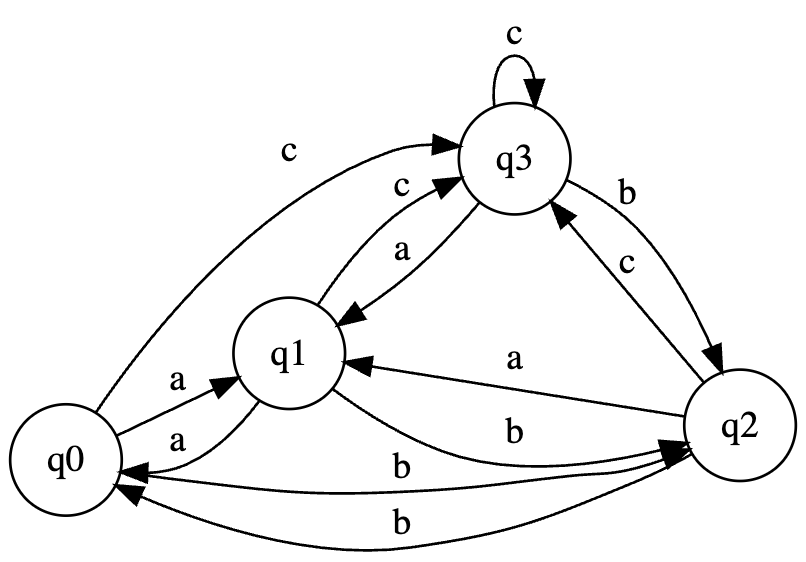

`Діаграма недетермінованого скінченого автомата. для варіанту `

**Поставлена задача**

Розробіть алгоритм та реалізуйте програму, що моделює роботу
недетермінованого скінченого автомата.

_Цей автомат дозволяє будь-яку послідовність "abc", "bca", "cab", і так далі. Щоб перейти в стан прийняття, останній символ має бути "a" або "b", або "c", або " ". Ось кілька прикладів слів, які можна утворити з цього автомата:_

abc
bca
cab
acba
babc
c
cc
abcc
і так далі...